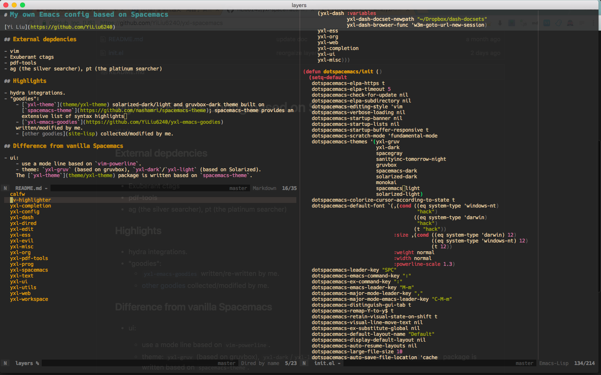

# My own Emacs config based on Spacemacs

[Yi Liu](https://github.com/YiLiu6240)

screenshot:

## External depdencies

- vim
- Exuberant ctags
- pdf-tools
- ag (the silver searcher), pt (the platinum searcher)
- hunspell, languagetool

## Highlights

- hydra integrations.
- "goodies":
    - [`yxl-theme`](theme/yxl-theme) solarized-dark/light and gruvbox-dark theme built on [`spacemacs-theme`](https://github.com/nashamri/spacemacs-theme); spacemacs-theme provides an extensive list of syntax highlights.
    - [`yxl-emacs-goodies`](https://github.com/YiLiu6240/yxl-emacs-goodies)
    written/modified by me.
    - [other goodies](site-lisp) collected/modified by me.

## Difference from vanilla Spacemacs

- ui:
    - use a mode line based on `vim-powerline`.
    - theme: `yxl-gruv` (based on gruvbox), `yxl-dark`/`yxl-light` (based on Solarized).
    The [`yxl-theme`](theme/yxl-theme) package is written based on `spacemacs-theme`.

- bindings:
    - more "vimish" bindings like C-h/j/k/l for window navigation
    - TODO

- packages:
    - package load-path: TODO
    - spacemacs base config: TODO
